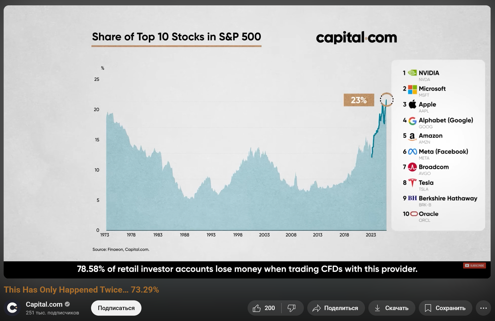

# Clickbait Detector

A machine learning-powered clickbait detection system with a Chrome extension and Flask API backend. This project uses ensemble methods to identify clickbait content with high accuracy, specifically designed to work with YouTube video titles.

## Screenshots

| High Clickbait Probability | Low Clickbait Probability |
| --- | --- |
|  |  |

## Architecture

```
├── backend/                    # Machine learning and API backend
│   ├── api/                   
│   │   ├── main.py            # Flask API server
│   │   └── utils.py           # Prediction utilities
│   ├── data/                  
│   │   └── clickbait_title_classification.csv  # Training dataset 
│   ├── models/                
│   │   ├── combined.joblib    # Ensemble model
│   │   ├── nb.joblib          # Naive Bayes model
│   │   ├── rf.joblib          # Random Forest model
│   │   └── gb.joblib          # Gradient Boosting model
│   └── notebooks/             
│       └── exploration.ipynb  # Data analysis and model training
├── frontend/                  # Chrome extension
│   ├── manifest.json          # Extension configuration
│   ├── popup.html/js/css      # Extension popup interface
│   └── scripts/               
│       └── content.js         # YouTube integration script
└── test/                      # Test suite
    └── test_predict.py        # Model prediction tests
```

## Features

### Machine Learning Models
- **Naive Bayes Classifier**: Text-based feature analysis using TF-IDF vectorization
- **Random Forest(RF) Classifier**: Engineered feature analysis
- **Ensemble Method**: Weighted combination of both models for improved accuracy

### Feature Engineering
RF classifier analyzes multiple aspects of titles:
- **Linguistic Features**: Question words, pronouns, punctuation patterns
- **Statistical Features**: Title length, word count, character distribution
- **Formatting Features**: Uppercase count, digit presence, quotation marks
- **Semantic Features**: Average word length, question mark presence

### Chrome Extension
- **Real-time Detection**: Automatically analyzes YouTube video titles
- **Visual Indicators**: Displays clickbait probability percentage
- **Non-intrusive**: Seamlessly integrates with YouTube's interface

## Installation

### Prerequisites
- Python 3.7+
- Chrome/Chromium browser
- Docker (optional, for containerized deployment)
- Git

### Quick Start - Local Development

1. **Clone the repository**
   ```bash
   git clone https://github.com/Swiifts/clickbait-detector.git
   cd clickbait-detector
   ```

2. **Install Python dependencies**
   ```bash
   pip install -r requirements.txt
   ```

3. **Start the Flask API server**
   ```bash
   cd backend/api
   python main.py
   ```
   The API will be available at `http://localhost:8000`

### Docker Deployment

Deploy the backend using Docker for easy containerization and production readiness.

#### Build the Docker Image
```bash
docker build -t clickbait-detector:latest .
```

#### Run the Container
```bash
docker run -p 8000:8000 clickbait-detector:latest
```

The API will be accessible at `http://localhost:8000`

Then run:
```bash
docker-compose up
```

### Chrome Extension Setup

1. **Open Chrome Extensions page**
   - Navigate to `chrome://extensions/`
   - Enable "Developer mode" (toggle in top-right corner)

2. **Load the extension**
   - Click "Load unpacked"
   - Select the `frontend` folder from your local repository

3. **Verify installation**
   - The extension icon should appear in your toolbar
   - Navigate to any YouTube video
   - You should see a clickbait probability badge next to the video title

## API Usage

### Health Check
```bash
curl http://localhost:8000/health
```

**Response:**
```json
{
    "status": "healthy",
    "message": "Clickbait API is running",
    "model_loaded": true
}
```

### Predict Clickbait
```bash
curl -X POST http://localhost:8000/predict \
  -H "Content-Type: application/json" \
  -d '{"title": "You Won'"'"'t Believe What Happened Next!"}'
```

**Example Response:**
```json
{
    "prediction": 1,
    "nb_probability": 0.892,
    "rf_probability": 0.756,
    "combined_probability": 0.824
}
```

**Response Fields:**
- `prediction`: 0 (not clickbait) or 1 (clickbait)
- `nb_probability`: Naive Bayes model confidence (0-1)
- `rf_probability`: Random Forest model confidence (0-1)
- `combined_probability`: Weighted ensemble score (0-1)

##  Privacy & Security

- **Local Processing**: All analysis happens locally or on your controlled server
- **No Data Collection**: The extension doesn't store or transmit personal data beyond the API
- **Minimal Permissions**: The extension only requires access to YouTube and the local Flask API
- **Model Security**: Pre-trained models are included; no model data is transmitted

## Troubleshooting

### Docker Issues

**"Port 8000 already in use"**
```bash
docker run -p 8001:8000 clickbait-detector:latest
```

**"Models not found" error**
Ensure the Dockerfile correctly copies the `backend/models` directory:
```dockerfile
COPY ./backend/models ./models
```

### Chrome Extension Issues

**Extension not detecting titles**
1. Ensure Flask API is running: `http://localhost:8000/health`
2. Check browser console (F12) for errors
3. Reload the extension from `chrome://extensions/`

**CORS errors**
The API includes CORS headers. If issues persist, verify `flask_cors` is installed:
```bash
pip install flask-cors
```

##  Development Status

**Current Version**: 0.1 

**Implemented Features**:
- ✅ Core ML models (NB + RF ensemble)
- ✅ Flask API with health monitoring
- ✅ Chrome extension with YouTube integration
- ✅ Feature engineering pipeline
- ✅ Language translation support

**Upcoming Features**:
- 🔄 Enhanced popup interface
- 🔄 Additional social media platform support
- 🔄 Model retraining pipeline
- 🔄 Performance analytics dashboard
- 🔄 Comprehensive test suite

## Contributing

1. Fork the repository
2. Create a feature branch (`git checkout -b feature/amazing-feature`)
3. Commit your changes (`git commit -m 'Add amazing feature'`)
4. Push to the branch (`git push origin feature/amazing-feature`)
5. Open a Pull Request

## License

This project is licensed under the Apache License 2.0 - see the [LICENSE](LICENSE) file for details.
